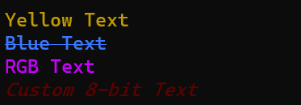

# CLI-Colors
A light-weight library for accessible terminal colors.

This is mainly taken from this [Stack Overflow answer](https://stackoverflow.com/a/33206814)


# Installation
cli\_colors is a package and can be installed using pip

```bash
pip3 install .
```
```bash
python3 -m pip install .
```

# Usage
The library provides two functions `color_print` and `color_str` and a handful of named colors and modifiers.

To use **cli_colors**, pass the text to be printed, the color of the text, and a list of modifiers to either of the functions, the only difference is that `color_print` prints the modified text, while `color_str` returns it.

**cli_colors** also provides the `color_generator` function. This loops over and yields a list of objects infinitely, to provide iterating colors or "themes" when repeatedly printing.

## Examples

```python
# Print yellow text
color_print("Yellow Text\n", YELLOW)

# Print blue bold crossed-out text
color_print("Blue Text\n", BLUE, MOD_BOLD, MOD_CROSS_OUT)

# Print using an RGB color
color_print("RGB Text\n", (255, 255, 100))

# Pass a custom 8-bit color
color_print("Custom 8-bit Text\n", MOD_8BIT + "52", MOD_ITALIC)
```


```python
# Color Generator
gen = color_generator([RED_SHADE1, RED_SHADE2])
for i in range(5):
    color_print(f"Line {i}", next(gen))

# Generating Themes
theme_gen = color_generator([[BLUE_SHADE1, MOD_UNDERLINE], [RED_SHADE2, MOD_ITALIC]])
for i in range(5):
    color_print(f"Line {i}", *next(theme_gen))
```
  


